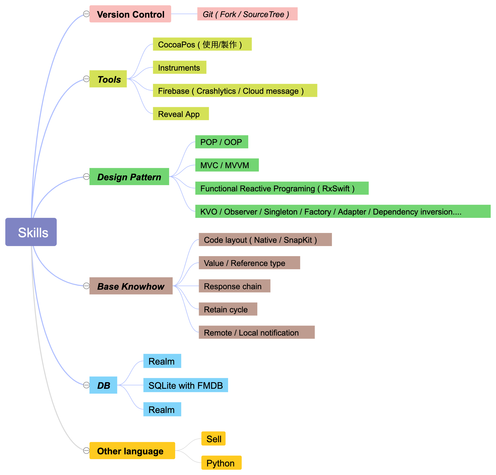

 <h1> 施翔日 ohlulu </h1> 

>*iOS Developer.*
>
>*Programmers are more than someone who writes codes. We are designers and architectures.*
>
>*[Github](https://github.com/ohlulu), [Blog](https://www.ohlulu.tw/), z30262226@gmail.com*

---

[TOC]

---

## 1. 自介

*有一點程式潔癖；所以喜歡研究架構。有一點懶；所以熱愛自動化。*

*有一點喜歡造輪子；所以想要徹底搞懂為什麼。有一點愛寫程式；所以寫程式*

喜歡滑板、音樂、小說、電影。

---

## 2. 技術介紹

### ・ [OhSwifter](https://github.com/ohlulu/OhSwifter)

>   UI initializer with fluent style.

-   鏈式 coding style。
    
-   相較常見的 `var lable: UILable = { //... }()` 方式，節省許多不必要的 code。
    
-   借鑒 RxSwift 的 `.rx.xxx` name-spacing :

    1.  控制 auto completed 的數量。

    2.  避免命名上的衝突。

-   封裝複數 config property :
    1.  UIView.border : width + color
    2.  UIView.shadow : color + radius + offset +  opacity
    
    

### ・ [SwiftMinions](https://github.com/SwiftMinions/SwiftMinions)

>    Instead of creating a product without reasons and purposes, we built our own framework from a clear starting point.

-   與朋友一起實作的，仿 [SwifterSwift](https://github.com/SwifterSwift/SwifterSwift) 的 extension library。
-   使用 Jazzy 製作[文件](https://swiftminions.github.io/doc/index.html)。
-   Unit test。
-   [Shell script](https://github.com/SwiftMinions/SwiftMinions/blob/master/Scripts/Release.sh) 自動化 release。
-   套件的幾個特色 :  

    1.  function 擁有可自訂的預設值：我們認為此類型套件最大的問題是「The default parameter of the function doesn't meet your needs」。

    2.  提供更易懂的命名空間「接下來的操作是安全的」:  `array.safe[0]`, `"string".safe[0...10]` ，

    3.  以 builder pattern 實作了一套簡單的 NSAttributeString builder。
-   😁 這是我最自豪的一個開源專案，或許不是很厲害的架構，但其中許多構想是由我提出並且完成的。

### ・ [CoderEngine](https://github.com/ohlulu/CoderEngine)

>   Assets.xcassets parser

-   Python 實作的腳本，解析 Assets.xcassets 轉換成 static computed property code。避免手動輸入時出現的失誤。
-   [這邊](https://www.ohlulu.tw/2020/04/19/coderengin-%e6%bc%82%e4%ba%ae%e7%9a%84%e6%96%b9%e5%bc%8f%e5%8f%96%e7%94%a8%e5%9c%96%e7%89%87) 有我寫的文章簡單介紹開發這套腳本的歷程。
-   😁 這是我自己最喜歡的一個腳本應用。

### ・ 其他

-   [Swift 數字處理大全](https://www.ohlulu.tw/2019/02/22/swift-number-detail/) : google 搜尋排名前幾的文章 ( 關鍵字: swift 四捨五入, swift 小數... )。
-   [Alamofire 封裝](https://github.com/ohlulu/NetworkDemo) : 在 iPlayground 2019 王巍大大的薰陶，寫了一個網路層的封裝，參考 Moya Task 的架構，並引入其中。
-   [Shell script](https://github.com/ohlulu/OhSwifter/blob/master/Scripts/release.sh)：只需輸入新的版號，即可依 git flow 自動 release 新的版本，並且 git push & pod push。
-   [Xcode-Snippets-theme-Template](https://github.com/ohlulu/Xcode-Snippets-theme-Template) : 自己常用的 code snippets & file template，使用 linux symbolic link 的方式在同步在 Github 上。

### ・ 技能樹

---

## 3. 工作經歷

### ・ iOS 軟體工程師 ( Team lead ) -- [果思設計](https://goonsdesign.com/)   *2018/09 ~ 現在* 

1.  2020年初升為 Tema Lead。

2.  提出了 Bug repoter 系統的構想，並實作中，目的在於「簡化回報Bug的流程 」以及「提升Bug回報的精度」。

3.  引導團隊開發了值日生Bot，從原本的單純呼叫「值日生倒垃圾」變成「@xx @xx 倒垃圾囉」，從此再也不用問這禮拜誰是值日生。

4.   引入 File template 規範團隊的程式架構，降低協作的困難度，增加產出的品質。

     

**專案經歷 ( 約90%獨立完成 )**

1.   待上線 APP  ( 2019/09–2020/04 )

     >   目前階段不方便公開，請見諒。

     -    使用 MVVM + RxSwift 開發，純 code layout。

     -    使用 Realm 資料庫，記錄使用者的購物車內容。

     -    使用 [網路組件](https://github.com/ohlulu/NetworkDemo)，於專案中輕鬆解決了「多裝置登入->SOO」的需求變更。

     -    專案中使用自己的開源套件 [OhSwifter](https://github.com/ohlulu/OhSwifter) ( UI initializer with fluent style )，大幅減少 UI 元件初始化時繁雜的 Code。

           

2.   [元盛生醫](https://goonsdesign.com/ici.html) - 膚質檢測APP  ( 2019/03–2019/08 )

     >   IoT 產品，使用儀器測量膚質，APP計算出建議保養品用量，並記錄膚質狀況。

     -   [Download on AppStore](https://apps.apple.com/tw/app/ici-en-orbite/id1477162797)。

     -   使用 MVVM + RxSwift 開發，純 code layout。

     -   使用 Realm 資料庫，記錄使用者的膚質檢測紀錄。

     -   使用 RxSwift 解決原生藍芽框架中大量的 Delegate，改為事件流的方式處理與儀器的交互。

     -   使用知名圖表套件 [Chart](https://github.com/danielgindi/Charts)，並結合遮罩，讓原本不會動的曲線圖動起來。

     -   客製 UI 元件，使用 UICollectionView 實作可滾動曲線圖，並加上標示點。

          

3.   [勤業眾信](https://www2.deloitte.com/tw/tc.html) - 企業用APP ( 2018/11 - 2019/3 )

     >   車資＆請假簽核系統，結合員工餐廳的餐點預定。

     -   使用 MVC 開發，純 code layout。

     -   使用 SQLite 紀錄購物車。

     -   介接企業內部原本的車資、請假簽核系統。

          

### ・iOS 軟體工程師 -- [桓基科技](http://www.hgiga.com/)   *2017/06 ~ 2018/08* 

1.   企業用通訊軟體 - iCa

	>   通訊軟體，並結合企業入口網中的各個模組。
    >   此專案幾乎無使用套件！
    
    
    -   負責功能的開發及維護。
    -   使用 core data 記錄聊天記錄
    -   使用原生的 URLSession 呼叫 API。
    -   使用原生的 autolayout 排版畫面。
    

---

## 4. 自我進修

平時滿喜歡聊程式，有定期參加 iOS@Taipei、CocoaHeads 聚會。

-   參加 iPlayground 2019
-   參加 [OysterSu](https://github.com/OysterSu) 主講的 CI/CD & Git 指令大全。

-   參加 [Natalie](https://github.com/lumanmann) 舉辦的讀書會，內容是 design pattern 的書。

---

*曾經相信在程式的世界中「只有想不到，沒有做不到」；如今帶著些微的程式潔癖，遊蕩於 iOS 的領域中。
過去懵懂無知、年少輕狂，留下許多遺憾；現在朝著一出手就是框架等級的架構師前進。*