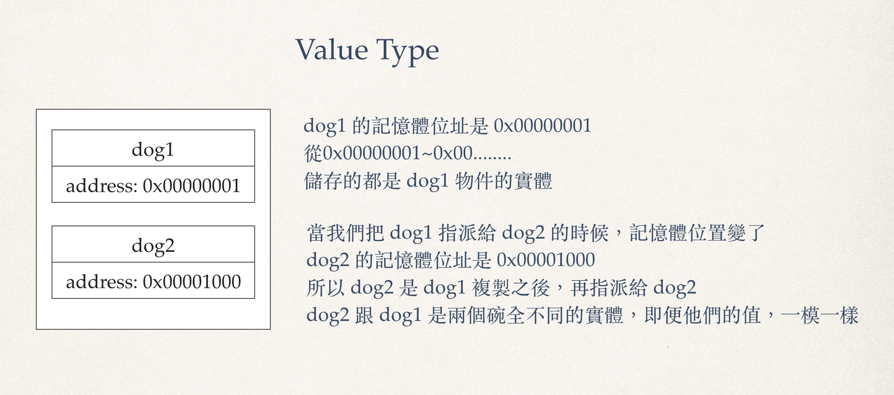

#  7. 類別 & 結構 (Class & Struct )

## 定義
類別通過關鍵字 `class` or `Struct` 表示，並在一對大括號中定義它們的具體內容：
```swift
class SomeClass {
    // ...
}

struct SomeStruct {
    // ...
}
```
> 注意：
> 在定義一個新類別或者結構的時候，實際上就是定義了一個新的 Swift 型別。所以我們使用 UpperCamelCase 這種方式來命名（如 SomeClass 和SomeStructure等），以便符合標準Swift 型別的大寫命名風格（如String，Int和Bool）

以下是定義類別的例子：

``` swift
struct Size {
    var width = 0
    var height = 0
}

class Frame {
    var x = 0
    var y = 0
    var size = Size()
}
```

實體化的方式：
```swift
let size = Size()
let frame = Frame()
```

結構和類別都使用建構器語法來生成新的實例。建構器語法的最簡單形式是在結構或者類別的型別名稱後跟隨一個空括弧，例如 `Size()` 或 `Frame()` 。通過這種方式所創建的類別或者結構實例，屬性均會被初始化為預設值（所有的屬性也必須給預設值）。更進階的建構方式，會在後面的[建構子章節](initial.md)做詳細的介紹

## 屬性存取
通過使用點語法（dot syntax），可以存取實例中所含有的屬性。語法規則是，在物件的名子後面接著使用屬性的名子，兩者通過點號(.)連接：

```swift
print("height is \(frame.size.height) ")
// height is 0 
```

當然，也可以用點語法來為變數賦值：
```swift
frame.size.height = 10
print("height is \(frame.size.height) ")
// height is 10 
```

# 結構型別的成員逐一建構器
所有 `結構` 都有一個自動生成的成員逐一建構器，用於初始化新結構實例中成員的屬性。新實例中各個屬性的初始值可以通過屬性的名稱傳遞到成員逐一建構器之中：
```swift
struct Person {
    let name: String
    let age: Int
}

let alen = Person(name: "Allen", age: 18)
```

這邊我們沒有為變數賦值，但編譯器也沒有警告我們，是因為編譯器自動幫我依照變數的順序，產生了一個建構器。

與結構不同，`類別(class)` 沒有預設的成員逐一建構器。建構子程章節會對建構器進行更詳細的討論。

# 結構和列舉是值型別(value-type)

值型別被賦予給一個變數，常數或者本身被傳遞給一個函式的時候，實際上操作的是其的拷貝。

在之前的章節中，我們已經大量使用了值型別。實際上，在 Swift 中，所有的基本型別：整數（Integer）、浮點數（floating-point）、布林值（Booleans）、字串（string)、陣列（array）和字典（dictionaries），都是值型別，並且都是以結構的形式在後台所實作。

在 Swift 中，所有的結構和列舉都是值型別。這意味著它們的實例，以及實例中所包含的任何值型別屬性，在程式碼中傳遞的時候都會被複製。

以 Dog 為例子：

```swift 
struct Dog: CustomDebugStringConvertible {
    var name = "阿牛"
    
    var debugDescription: String {
        return name
    }
}

var dog1 = Dog()
var dog2 = dog1
print("dog1 -> \(dog1)")
print("dog2 -> \(dog2)")

dog1.name = "糖牛"

print("dog1 -> \(dog1)")
print("dog2 -> \(dog2)")

```

> 列舉也遵循相同的行為准則

## 類別是參考型別(reference-type)

與值型別不同，參考型別在被賦予到一個變數，常數或者被傳遞到一個函式時，操作的並不是其拷貝。因此，參考的是已存在的實例本身而不是其拷貝。

我們將 Dog 改成用 class 宣告，並看看其中的差異：

```swift
class Dog: CustomDebugStringConvertible {
    var name = "阿牛"
    
    var debugDescription: String {
        return name
    }
}

var dog1 = Dog()
var dog2 = dog1
print("dog1 -> \(dog1)")
print("dog2 -> \(dog2)")

dog1.name = "糖牛"

print("dog1 -> \(dog1)")
print("dog2 -> \(dog2)")
```

說明一下為什麼會是這樣：
* 參考型別，其實盒子裡面儲存的，是記憶體的位址，這個位址，會指向物件的實體群放的記憶體位址，盒子儲存的是一個參考，所以叫做參考型別

* 值型別，盒子裡便儲存的，就是物件本身，也就是值本身，所以叫做值行別

下面用兩張圖來說明一下，物件在記憶體中的實際狀況：

